# 20241226_chiangrai

<html>
<head>

<meta charset="UTF-8">
<meta http-equiv="Content-Type" content="text/html; charset=UTF-8">
<meta http-equiv="X-UA-Compatible" content="IE=EmulateIE10" />
<meta http-equiv="X-UA-Compatible" content="IE=edge">

<!--ここから上はお決まりの定型文です-->

<!--ここからが表現の書式などを決めるcssという部分-->

<link href="https://cdnjs.cloudflare.com/ajax/libs/lightbox2/2.7.1/css/lightbox.css" rel="stylesheet">

</head>

<body>

モバイル端末をお使いの場合は、画面を横向きにすると
より見やすくご覧頂けます。

<!--ここ上は、ほぼそのまま使います！-->

<!--QRコードの挿入例-->

 アクセス用QRコード

<marquee direction="left" scrollamount="20" width="30%">(^_^)/~alis</marquee>

<!--流れ文字の挿入例-->
<h1><marquee behavior="left">!!! 2024/12/26 、タイ北部の街メーチャン郊外で、年に1度開催される地域のお祭り !!!</marquee></h1>

                          

<!--ここから下が、本体部分-->

<h2>今回のお祭り会場はこの辺り 画像のクリックでGoogleMapsに飛びます</h2>

<a href="https://www.google.com/maps/place/ศกร.ตำบลจอมสวรรค์/@20.195319,99.8968815,14.6z/data=!4m6!3m5!1s0x30d657c321b93905:0xc7d9c36477d39e5c!8m2!3d20.1965675!4d99.9029547!16s%2Fg%2F11h1j7xjns!5m1!1e2?entry=ttu&g_ep=EgoyMDI0MTIxMS4wIKXMDSoASAFQAw%3D%3D" target="_blank">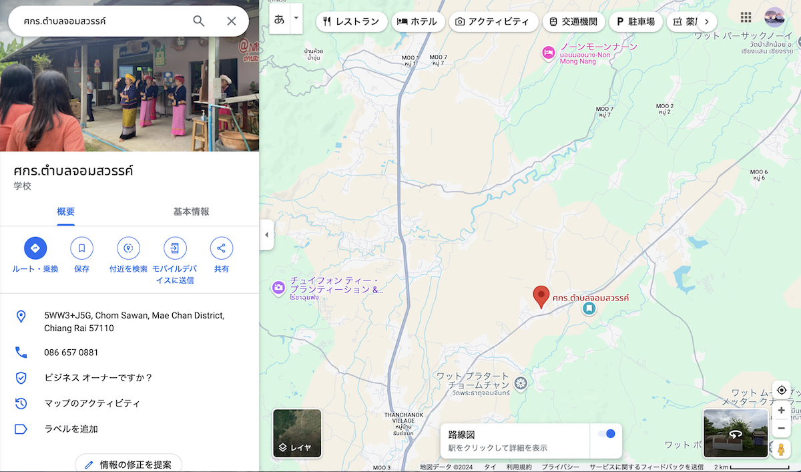</a>

<h2>朝から重低音を響かせてお祭りがスタート。周辺が車で埋め尽くされました</h2>

<a href="20241226_001.JPG" target="_blank">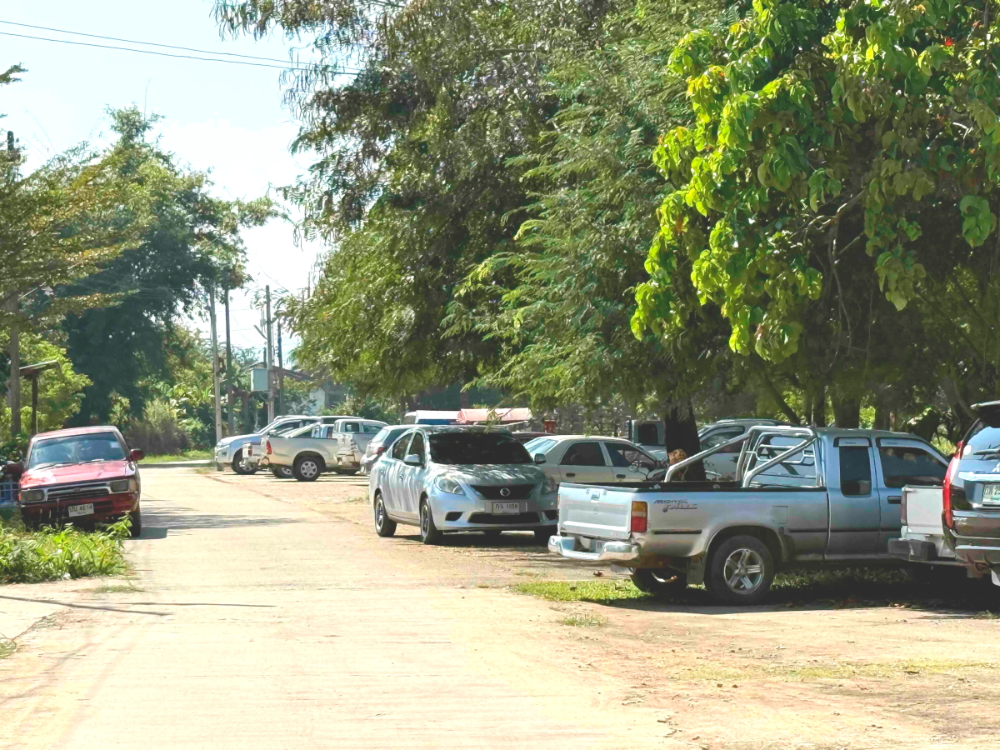</a>
<a href="20241226_002.JPG" target="_blank">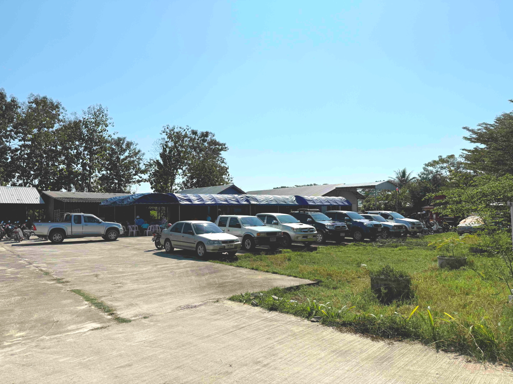</a>
<a href="20241226_003.JPG" target="_blank">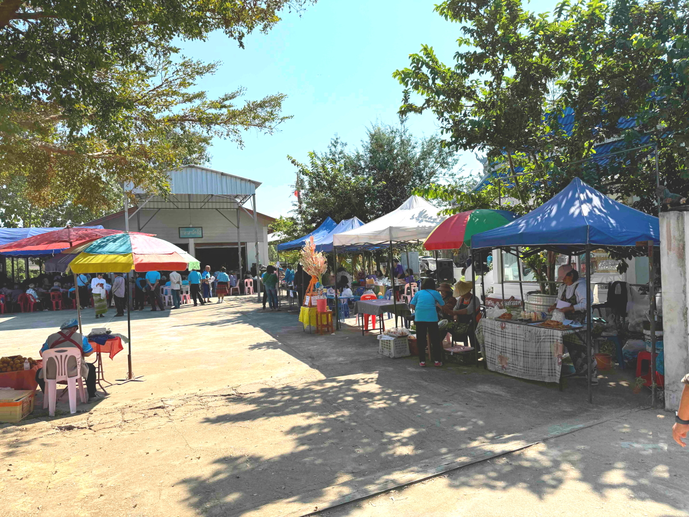</a>
<a href="20241226_004.JPG" target="_blank">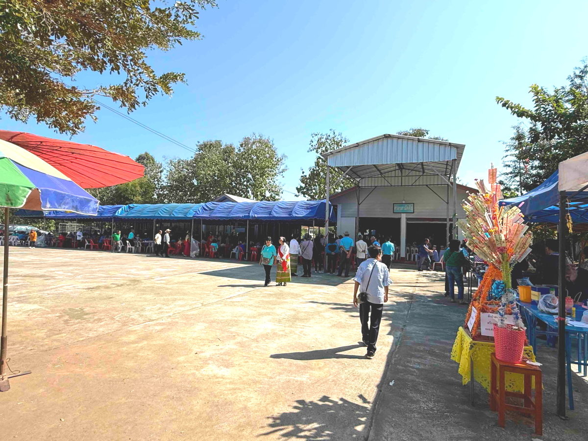</a>

<h2>民族衣装着て、大カラオケ大会</h2>
<a href="20241226_005.JPG" target="_blank">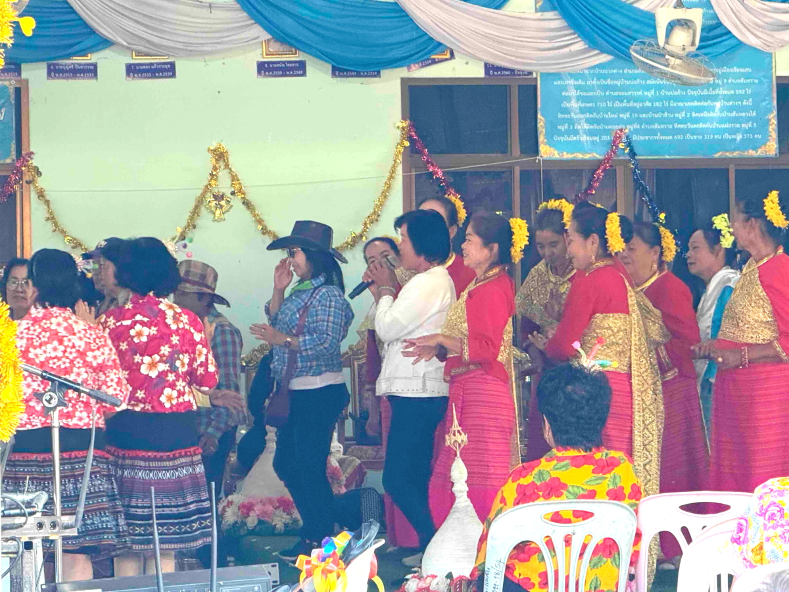</a>

<h2>上の画像の動画</h2>
<iframe width="560" height="315" src="https://www.youtube.com/embed/06rHpVU9lzY?si=SMPSJku7acg9vQUv" title="YouTube video player" frameborder="0" allow="accelerometer; autoplay; clipboard-write; encrypted-media; gyroscope; picture-in-picture; web-share" referrerpolicy="strict-origin-when-cross-origin" allowfullscreen></iframe> 

<h2>選手交代してノリノリです</h2>
<iframe width="560" height="315" src="https://www.youtube.com/embed/NLYgMbbUppc?si=RO8v_2z3qbQ6xBKp" title="YouTube video player" frameborder="0" allow="accelerometer; autoplay; clipboard-write; encrypted-media; gyroscope; picture-in-picture; web-share" referrerpolicy="strict-origin-when-cross-origin" allowfullscreen></iframe> 

<h2>ほとんどの参加者は、飲食で1日過ごします</h2>
<a href="20241226_006.JPG" target="_blank">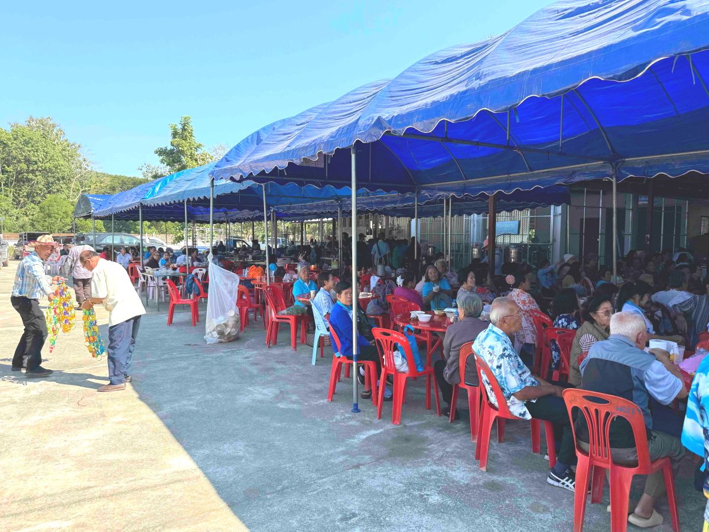</a>
<a href="20241226_007.JPG" target="_blank">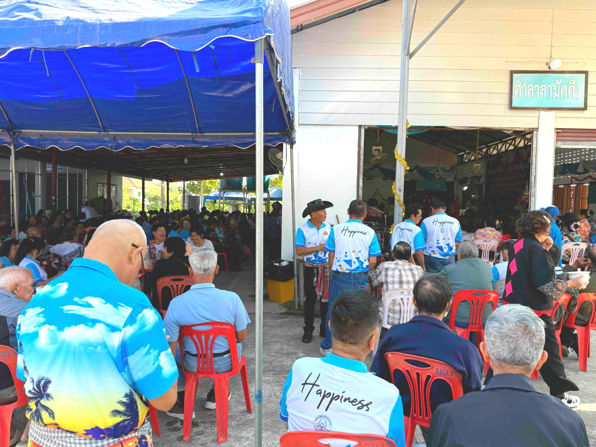</a>
<a href="20241226_008.JPG" target="_blank">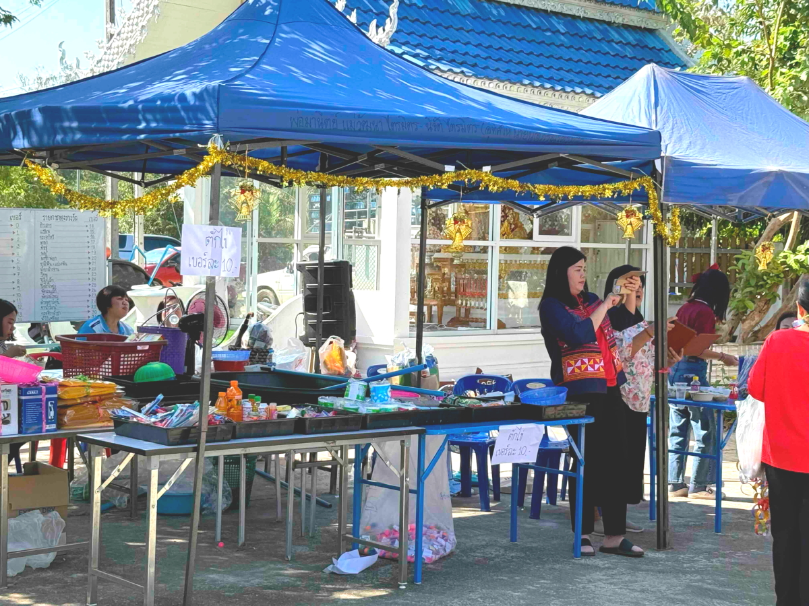</a>

<h2>民族衣装のスタッフの女性を囲んで記念撮影</h2>
<a href="20241226_009.JPG" target="_blank">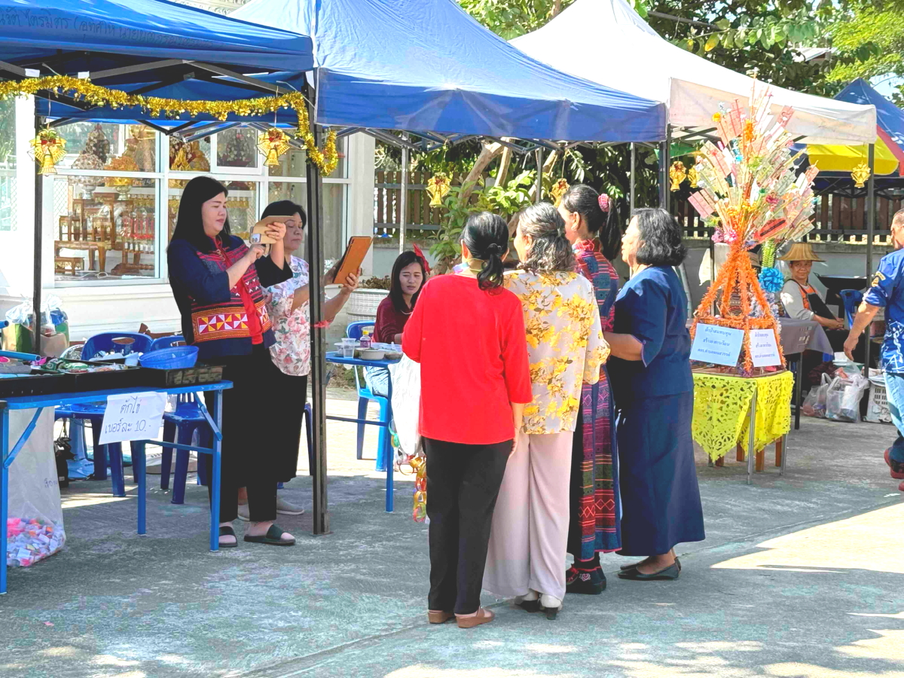</a>

<h2>人が集まるところに必ず居る宝くじのお姉様</h2>
<a href="20241226_010.JPG" target="_blank">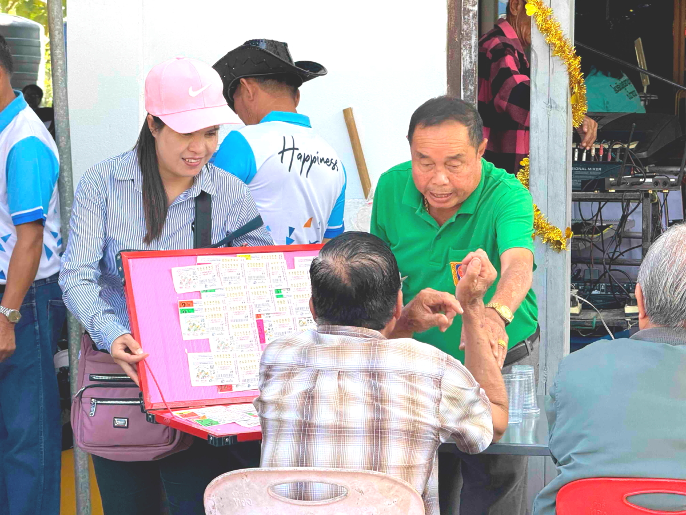</a>

<h2>このGrもノリノリでした</h2>

<h2>最初のGrが再登場！</h2>
<a href="20241226_012.JPG" target="_blank">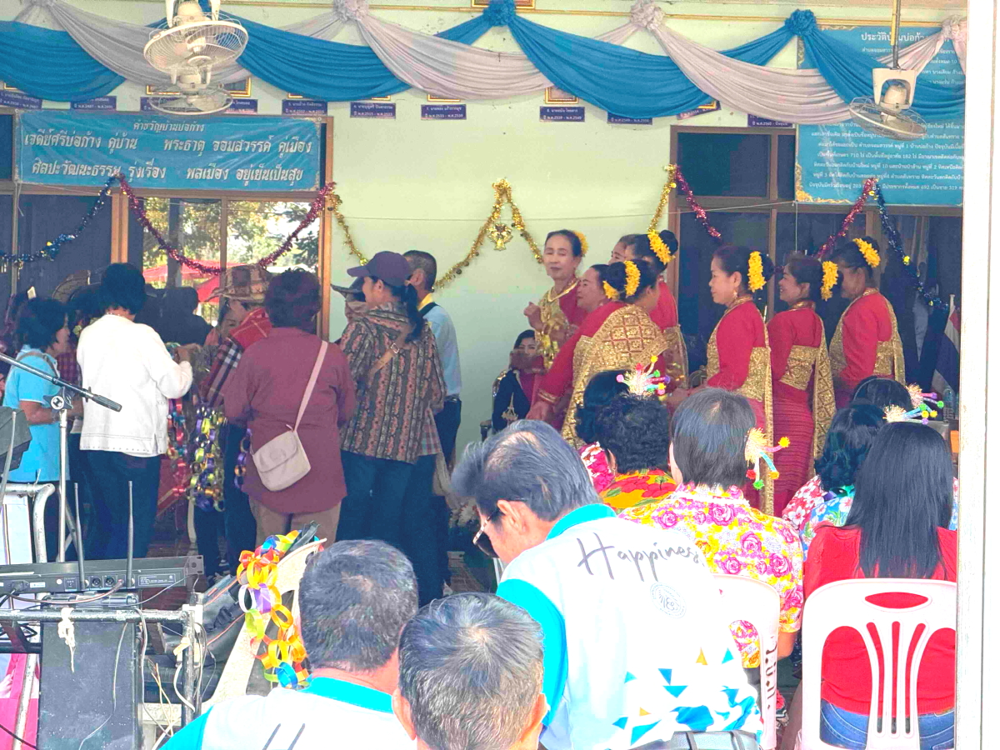</a>

  

<h2>集落ごとに伝統の衣装が違ってて、 その昔は服装でどこから来たかを見分けてたとのこと</h2>

<h2>
<a href="https://torokoid.github.io/20241126_chiangrai/" target="_blank">Back to the menu page</a>
</h2>

   

   

         

  

      

<!--本体はここまで-->

<!--画面に空白地帯を作って、背景が見えるようにしています-->
                                              

<!-- フッタ -->
<footer>

Copyright 2024/12/26 alis @ChiangRai

</footer>

<!--HPにさまざまなJavaScriptを呼び込むための書式-->

